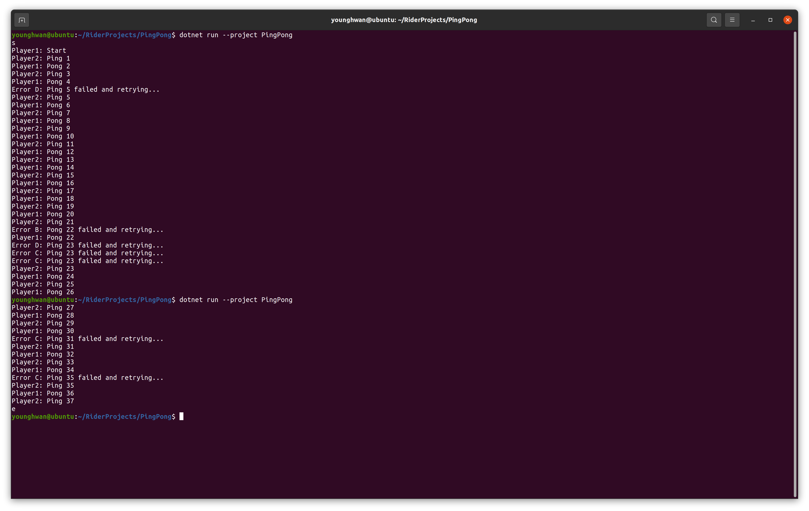

# C# Ping Pong

An example ping-pong program that uses [ABP Event Bus](https://docs.abp.io/en/abp/5.0/Event-Bus) and [Quartz.net Job Scheduler](https://www.quartz-scheduler.net).



## Usage

Create a SQLite DB file for `Quartz`.

```
sqlite3 -init quartznet_tables_sqlite.sql quartznet.db .quit
```

Run program.
```
dotnet run --project PingPong
```

- Enter `s` to start.
- Force exiting (e.g. ctrl+c) and restarting will resume ping-pong count.
- Enter `e` to end and clear database to reset ping-pong count.
